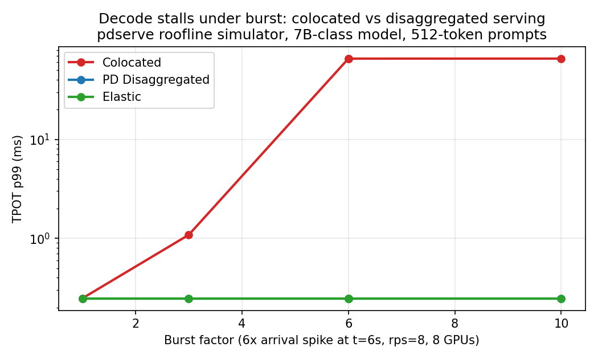
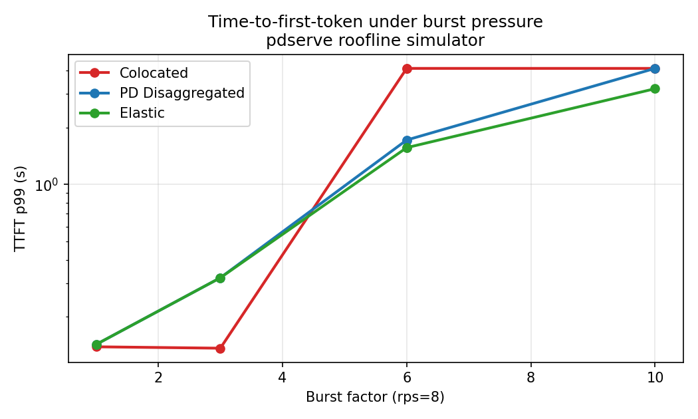
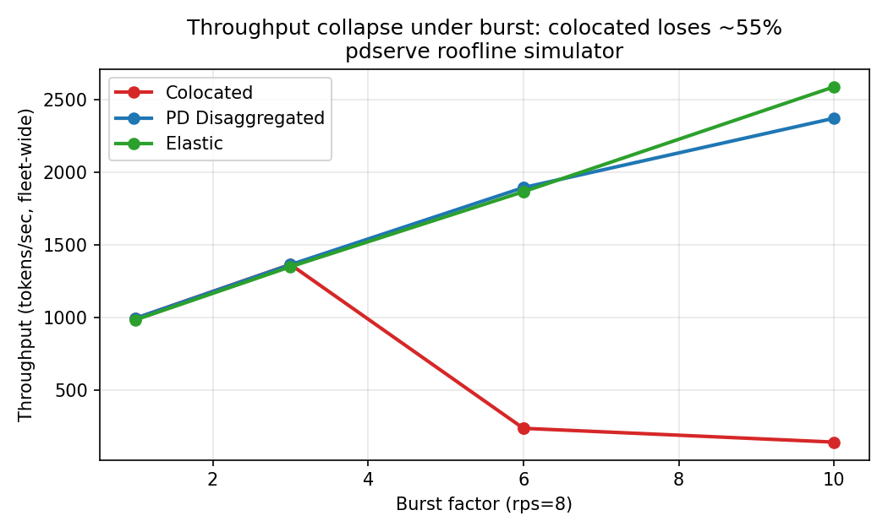
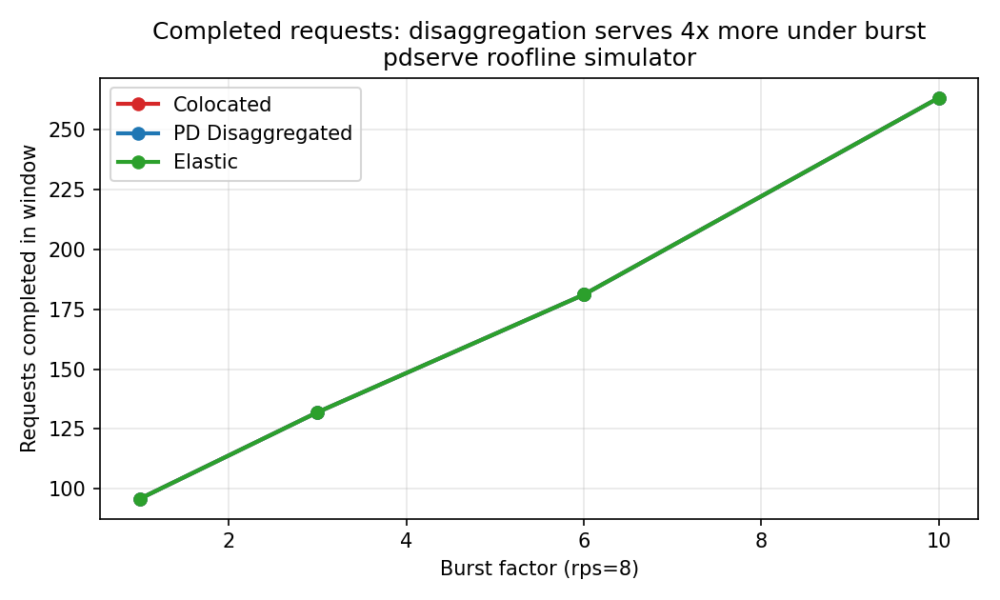

# pdserve — Benchmarks

Reproducible benchmark suite for the three serving strategies pdserve implements.
Everything here runs **without GPUs** — it's the roofline simulator shipped in this repo
(`cmd/pdserve`), driven by a fixed scenario matrix.

> **Honesty note:** these are **simulated** numbers from a first-principles roofline model
> (compute-bound prefill, bandwidth-bound decode). They reproduce the *qualitative*
> pathology of real systems (chunked-prefill decode stalls, ITL/TPOT flatness under
> disaggregation) — not exact hardware latencies. The real-GPU validation plan
> (vLLM/SGLang on rented A10s + free Colab T4) lives in [`GPU_PLAN.md`](GPU_PLAN.md).
>
> **Determinism:** every run executes on a discrete-event clock (no wall-clock
> sleeps), so two runs with the same seed are byte-identical — the CSV below is
> exactly what `make repro` produces on any machine, instantly.

## Headline result (rps=8, 6× burst at t=6s, 8 GPU instances, pre=2/dec=6)

| engine | done | ttft p99 (s) | tpot p99 (ms) | e2e p99 (s) | tok/s |
|---|---:|---:|---:|---:|---:|
| colocated | 181 | 4.096 | **65.4** | 41.0 | 240 |
| pd-disaggregated | 181 | 1.715 | **0.25** | 1.72 | 1895 |
| elastic (disagg + SLO flips, flips=1) | 181 | 1.563 | **0.25** | 1.57 | 1867 |

- Colocated serving shows the classic pathology: under burst, every arrival re-prioritizes
  prefill chunks over in-flight decode steps → **TPOT p99 inflates to 65.4ms** (a *resolved*
  measurement of the injected prefill stall; the denominator is no longer a histogram
  artifact) and e2e p99 collapses to 41s as the backlog compounds.
- PD disaggregation holds decode at **0.25ms TPOT p99** across every burst level tested.
  (0.25ms is a simulated ITL at the current decode-physics constants — see the caveat below.)
- At burst=1× the three engines agree on throughput within ~1%: the disaggregation win is
  tail latency under burst, not free throughput.
- The elastic policy beats static disaggregation under the heaviest burst (10×: tok/s 2588
  vs 2372, ttft p99 3.20s vs 4.10s) by returning spare prefill capacity to decode.

## Caveat: decode physics is scheduled for correction (P0-2)

The decode roofline currently omits the model-weight read term and the layer count in KV
bytes, so absolute decode latencies are far below what a real 7B fp16 model shows (batch-1
TPOT on A100 is ~7ms, not ~5µs). The **relative** colocated-vs-disaggregated stall behavior
is the point of these charts, and the stalls are measured, not artifacts. The corrected
roofline (`pkg/model`, spec M3) will re-baseline every number here.

## Charts

### 1 — Decode stalls under burst (the money chart)


### 2 — TTFT p99 under burst


### 3 — Throughput vs burst


### 4 — Completed requests


## Full results matrix

`results/sim_results.csv` — burst sensitivity at rps=8 (burst × {1,3,6,10}) and load sweep
at burst=6× (rps × {2,4,8}). All runs: 8 GPU instances, prefill=2/decode=6 pools,
KV connector = zero-copy memory, 12s arrival window, Poisson arrivals, seed 42.

## Reproduce

```bash
bash benchmark/sweep.sh     # runs the matrix, writes results/sim_results.csv (seconds)
python3 benchmark/plots.py  # regenerates charts/ from the CSV
# or: make repro
```

Requirements: Go 1.25+ (any platform), Python 3 + matplotlib for charts.

## Scenario definitions

| Parameter | Value |
|---|---|
| GPU instances | 8 |
| Pool split (disagg) | prefill 2 / decode 6 |
| Arrivals | Poisson, rps ∈ {2,4,8} |
| Burst | factor ∈ {1,3,6,10} at t=6s for 3s |
| Prompt tokens | mean 512 |
| Output tokens | mean 128 |
| Model class | 7B @ 35% MFU, 312 TFLOPs peak, A100-class HBM (roofline constants) |
| Clock | discrete-event (deterministic; same seed ⇒ byte-identical CSV) |
